# Manual Técnico - Motor de Ejecución ELI

## 1. Resumen del Sistema
Este documento describe de manera técnica la arquitectura interna y las metodologías de diseño empleadas en el desarrollo del **Intérprete ELI**. El motor funciona como un procesador de lenguaje especializado (DSL) enfocado en la administración de datos NoSQL, utilizando archivos JSON como soporte físico de almacenamiento.

## 2. Estructura y Flujo de Trabajo
El núcleo del proyecto se divide en dos fases fundamentales (Frontend y Backend), articuladas mediante la implementación del **Patrón de Diseño Interpreter**.

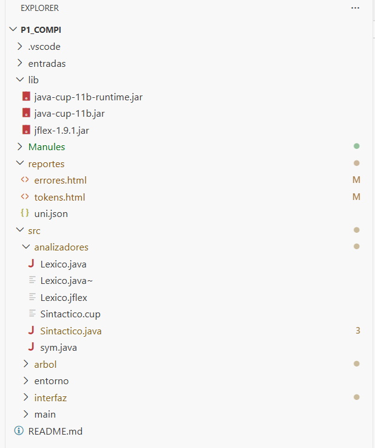

El ciclo de vida de una instrucción sigue este orden:
1.  **Entrada de Datos:** Se obtiene el código fuente desde el editor de la interfaz (`StringReader`).
2.  **Fase Léxica:** Mediante `JFlex`, el flujo de texto se categoriza en una serie de unidades léxicas (tokens).
3.  **Fase Sintáctica:** `Java CUP` procesa los tokens según una gramática predefinida, construyendo una estructura jerárquica conocida como Árbol de Sintaxis Abstracta (AST).
4.  **Procesamiento Semántico:** Se recorren los nodos del AST para ejecutar las funciones correspondientes y actualizar el estado de la memoria.
5.  **Persistencia:** La información procesada en memoria se traduce y guarda en un archivo JSON físico.

---

## 3. Especificaciones Tecnológicas
* **Lenguaje de Programación:** Java (Versión 17 o superior, en este caso se uso la version 25).
* **Generador Léxico:** JFlex 1.9.1.
* **Generador Sintáctico:** Java CUP 11b.
* **Capa Gráfica:** Java Swing.
* **Salidas de Datos:** Formato JSON para registros y HTML para la visualización de reportes.

---

## 4. Componente Léxico (Scanner)
La unidad encargada del escaneo (`Lexico.jflex`) identifica los patrones mínimos del lenguaje a través de Expresiones Regulares (ER).

### 4.1. Patrones de Reconocimiento
* **Variables/Nombres:** `[a-zA-Z][a-zA-Z0-9_]*`
* **Literales de Cadena:** `\"[^\"]*\"`
* **Valores Numéricos:** `[0-9]+` (enteros) y `[0-9]+ \. [0-9]+` (flotantes).

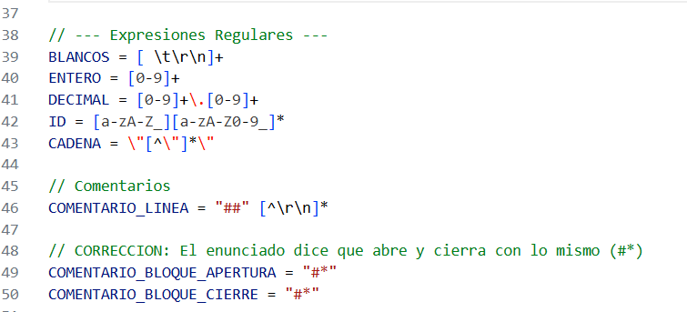

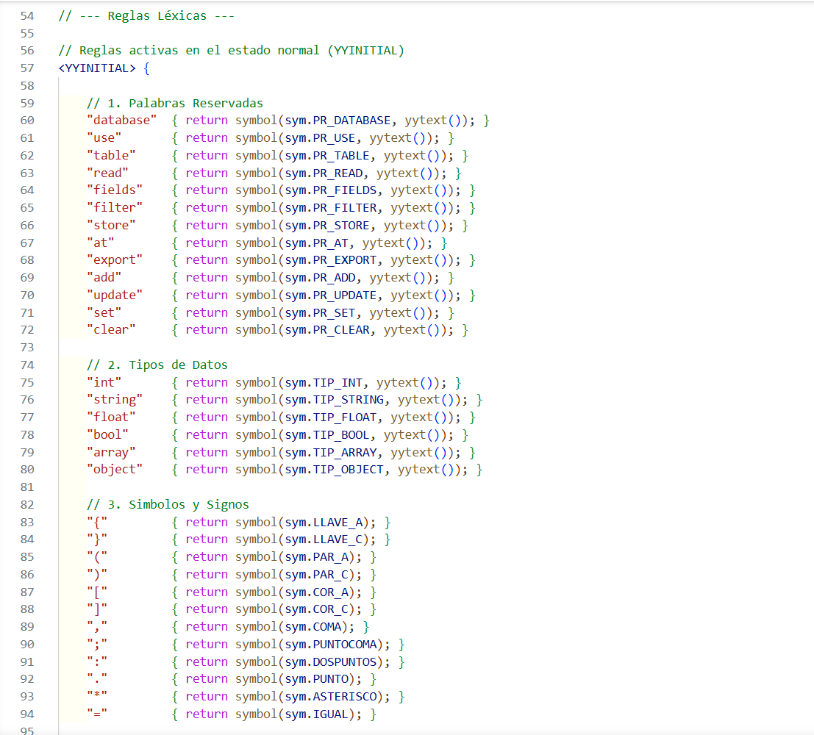

### 4.2. Trazabilidad de Tokens
Se personalizó el método `symbol()` en JFlex para que, al reconocer un elemento, este se registre simultáneamente en el listado global del Contexto, permitiendo la creación inmediata del **Informe de Tokens**.

---

## 5. Procesamiento Sintáctico y Construcción del AST
El análisis sintáctico (`Sintactico.cup`) utiliza un algoritmo LALR (ascendente). Su función principal es la creación de los objetos que conforman el **Árbol de Sintaxis Abstracta (AST)**.

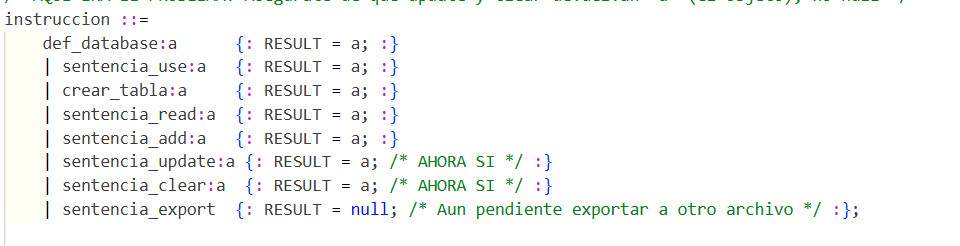

### 5.1. Implementación del Patrón Interpreter
La lógica de ejecución se apoya en dos abstracciones dentro del paquete `arbol`:
1.  **`Instruccion`**: Clases que ejecutan comandos que alteran el sistema sin devolver un valor (ej. `Add`, `Create`).
2.  **`Expresion`**: Clases destinadas a resolver operaciones y retornar un resultado (ej. `Aritmetica`, `DatoPrimitivo`).

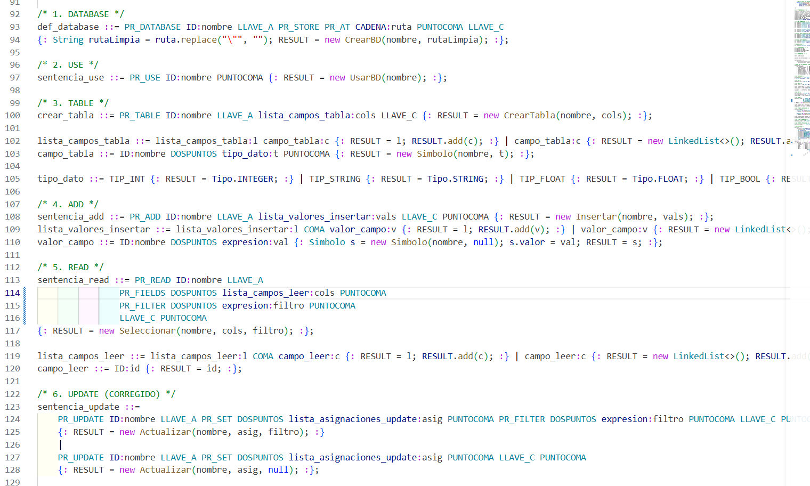

### 5.2. Lógica de Consultas (Read)
Al procesar una instrucción `read`, el sistema instancia un nodo de selección. Este nodo genera un **Entorno de Evaluación Temporal** por cada registro en la tabla; si la condición de la `Expresion` de filtrado resulta verdadera, los datos de esa fila se incluyen en el resultado final.

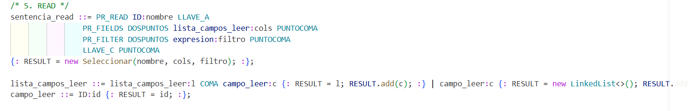
---

## 6. Gestión de Memoria y Ámbitos (Tabla de Símbolos)

La administración de los datos en tiempo de ejecución se organiza jerárquicamente:

### 6.1. Contexto Maestro (Singleton)
La clase `Contexto` centraliza toda la información volátil del programa. Utiliza el patrón **Singleton** para asegurar una fuente única de verdad.

Almacena:
* `HashMap<String, Tabla> tablas`: El repositorio de datos en memoria.
* `LinkedList<Excepcion> errores`: Bitácora de incidencias detectadas.
* `LinkedList<Token> tokens`: Historial de componentes léxicos procesados.

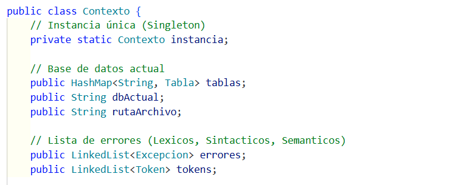

### 6.2. Ámbito Local (Environment)
La clase `Entorno` actúa como una Tabla de Símbolos dinámica (`HashMap<String, Simbolo>`). Se emplea durante operaciones como `UPDATE` o `READ` para mapear temporalmente los nombres de las columnas con sus valores actuales, permitiendo que las expresiones resuelvan variables correctamente.

c
---

## 7. Almacenamiento y Persistencia (JSON)
El intérprete gestiona su propia persistencia sin depender de drivers externos. Cada vez que ocurre un cambio significativo (como insertar un dato), se dispara el procedimiento `actualizarArchivo()`.
Este motor de persistencia utiliza `StringBuilder` para iterar sobre las estructuras del `Contexto` y reconstruir manualmente la cadena de texto con formato JSON, garantizando la integridad del archivo físico.

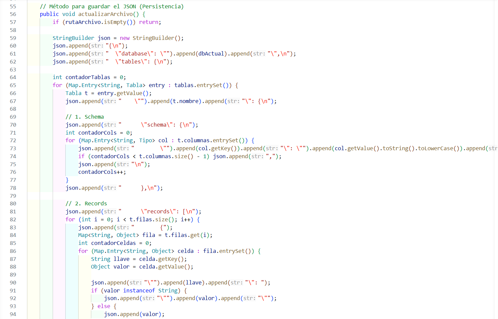

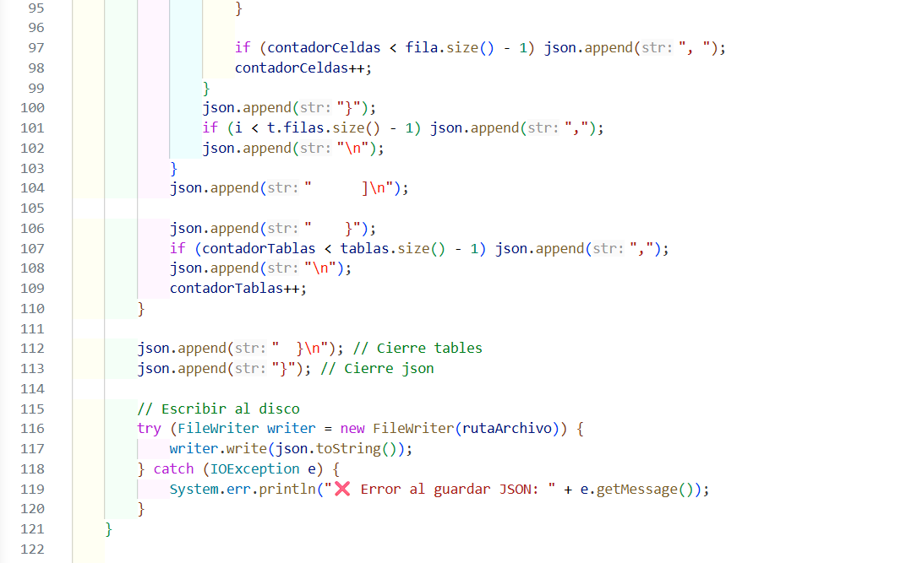
---

## 8. Estrategia de Control de Errores
El sistema adopta el mecanismo de **Recuperación en Modo Pánico**:
1.  **Anomalías Léxicas:** Cualquier carácter no reconocido es atrapado por la regla comodín `[^]` de JFlex, registrándose en el historial de errores sin detener el escaneo.
2.  **Anomalías Sintácticas:** Se utiliza el método `syntax_error` de CUP para documentar producciones no válidas, apoyándose en la palabra clave `error` dentro de la gramática para saltar el bloque conflictivo y continuar con la siguiente sentencia válida.

# Capas utilizadas en el proyecto

## 1. Capa 1: La Cara del Proyecto (Paquete `interfaz`)
Esta capa gestiona la interacción directa con el usuario. Su función principal es la recolección de entradas de texto y la visualización de resultados procesados.

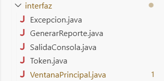

### Componentes Clave:
* **`VentanaPrincipal.java`**: Actúa como el controlador visual de la aplicación. Implementa el método `analizar()`, el cual extrae el texto del `JTextArea` (`txtEntrada`) y lo envía a través de un `StringReader` directamente al Analizador Léxico, optimizando el rendimiento al trabajar directamente en memoria sin archivos temporales.

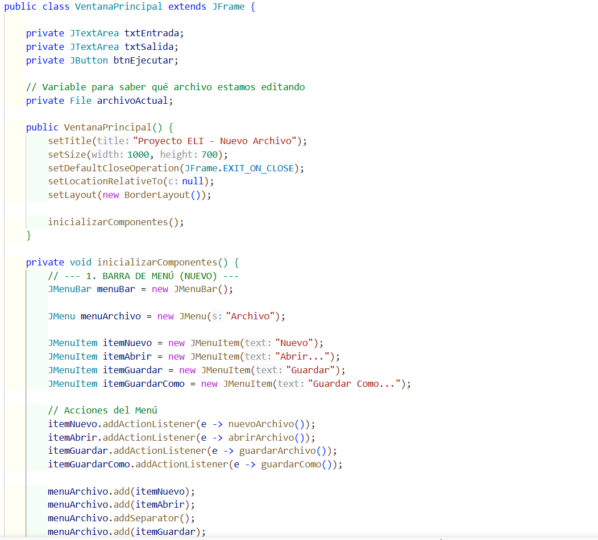

* **`SalidaConsola.java`**: Implementa una redirección de flujo extendiendo de `OutputStream`. Intercepta las llamadas de `System.out.println()` para mostrarlas dinámicamente en el componente gráfico de salida (`txtSalida`).

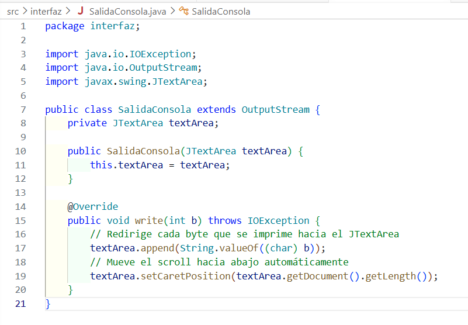

* **`GenerarReporte.java`**: Se encarga de la persistencia de reportes. Procesa las listas globales de errores y tokens utilizando `StringBuilder` para estructurar tablas en HTML y guardarlas físicamente en el disco.

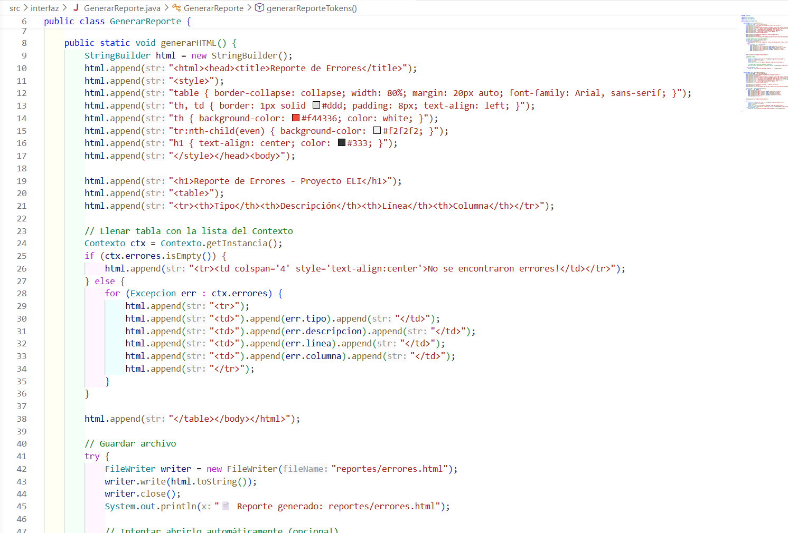

---

## 2. Capa 2: Los Traductores (Paquete `analizadores`)
Representa el núcleo del compilador, donde el flujo de caracteres se transforma en estructuras de datos manipulables por Java.

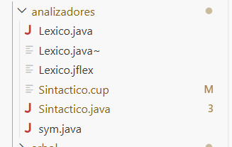

### Lexico.jflex (Escáner)
Es el encargado de agrupar caracteres en **Tokens**.
* **Manejo de espacios**: Utiliza expresiones regulares como `[ \t\r\n\f]` sin acciones de retorno para ignorar caracteres en blanco.
* **Registro Dinámico**: Se personalizó el método `symbol()` para que cada token válido se almacene automáticamente en el Singleton `Contexto.getInstancia().tokens`.

### Sintactico.cup (Parser)
Valida la estructura gramatical del código siguiendo una gramática libre de contexto.
* **Generación de AST**: Más allá de la validación, su objetivo es instanciar el Árbol de Sintaxis Abstracta. Por ejemplo, al reconocer una regla de limpieza, ejecuta `RESULT = new Limpiar(nombre)`, retornando finalmente una `LinkedList<Instruccion>`.

---

## 3. Capa 3: El Cerebro / El Árbol (Paquete `arbol`)
Implementa el **Patrón de Diseño Interpreter**, donde cada nodo del árbol es una clase capaz de ejecutarse a sí misma.

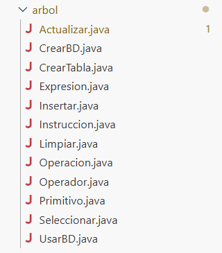

### Jerarquía de Clases:
1.  **Familia `Instruccion`**: Comandos que modifican el estado del sistema sin retornar valores (ej. `CrearTabla`, `Insertar`). Implementan `ejecutar(Entorno)`.
2.  **Familia `Expresion`**: Operaciones que calculan y devuelven un valor (ej. `Operacion`, `Primitivo`). Implementan `evaluar(Entorno)`.

### Lógica de Filtrado (`Seleccionar.java` y `Actualizar.java`):
Para resolver condiciones como `edad > 20`, el sistema realiza los siguientes pasos:
1.  Extrae las filas de la tabla seleccionada.
2.  Crea un **Entorno Local** (memoria temporal) por cada fila.
3.  Carga los valores de la fila en dicho entorno.
4.  Solicita a la `Expresion` del filtro que se evalúe utilizando esa memoria específica.
5.  Si el resultado es `true`, la fila se incluye en la operación; de lo contrario, se descarta.

---

## 4. Capa 4: La Memoria y Persistencia (Paquete `entorno` y `Contexto`)
Simula el comportamiento de una base de datos directamente en la memoria RAM.

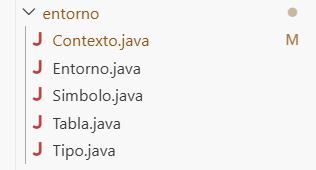

### Gestión de Datos:
* **`Contexto.java` (Singleton)**: Memoria global del sistema. Al usar el patrón Singleton, garantiza que todos los componentes (UI, Analizadores y AST) compartan la misma instancia del `HashMap` de tablas, evitando inconsistencias por duplicidad de datos.
* **`Tabla.java`**: Define la estructura de datos. Contiene un mapa para el esquema de columnas y una `LinkedList<HashMap<String, Object>>` para los registros, donde cada entrada es un diccionario clave-valor.

### Persistencia:
* **`Contexto.actualizarArchivo()`**: Motor de serialización. Recorre las estructuras en memoria y, mediante lógica de iteración, traduce los objetos de Java a una cadena con formato **JSON** estándar para su almacenamiento permanente en disco.