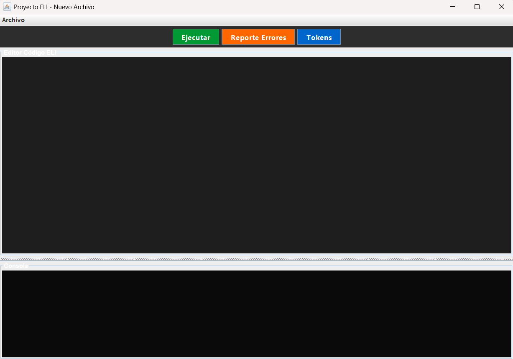
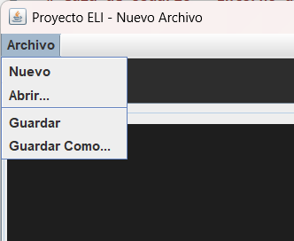
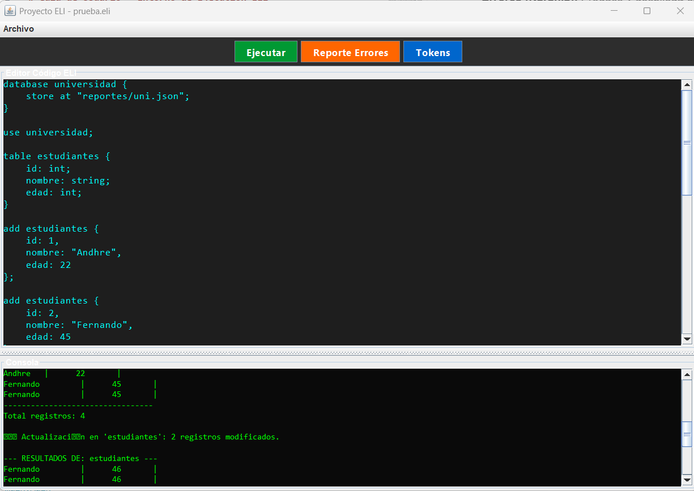
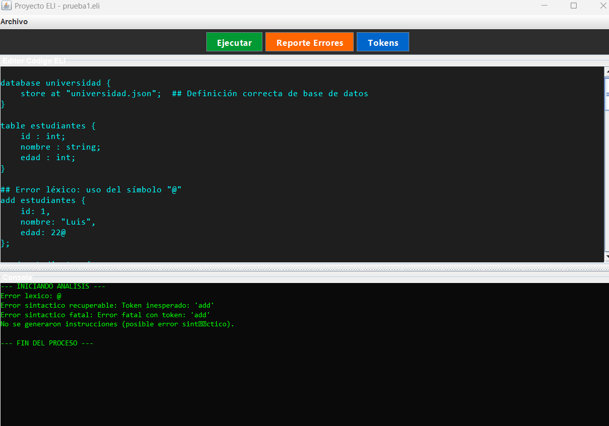
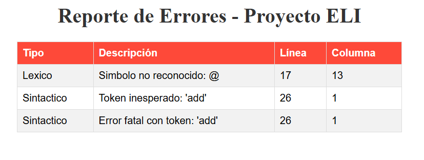
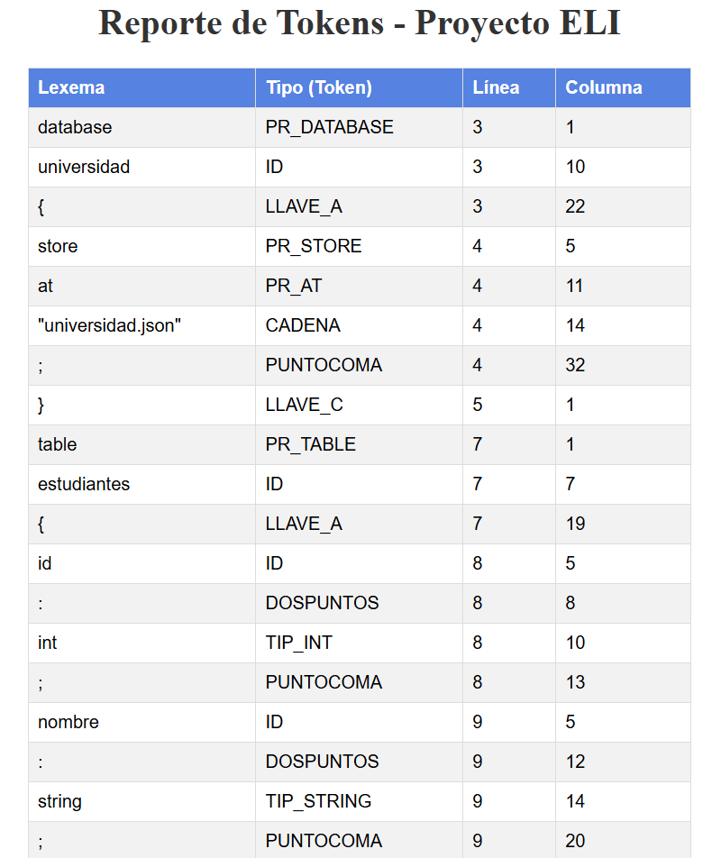

# Guía de Usuario - Entorno de Ejecución ELI

## 1. Visión General
Te damos la bienvenida a la plataforma de desarrollo del **Ecosistema ELI**. Esta herramienta funciona como un IDE especializado y un gestor de bases de datos NoSQL, diseñado para facilitar la escritura, el procesamiento y la gestión de instrucciones de forma ágil. El sistema destaca por su independencia, gestionando toda la persistencia de datos localmente mediante archivos en formato JSON.

## 2. Pre-requisitos
Para asegurar un funcionamiento óptimo, el equipo debe contar con:
* **Entorno de Ejecución Java (JRE):** Versión 17 o posterior (en este caso se utilizo la version 25).
* **

---

## 3. Interfaz Gráfica (El Entorno de Trabajo)

## 3.1. Gestión de Archivos (Menú Superior)

En la parte superior izquierda encontrarás las herramientas para administrar tus scripts con extensión `.eli`:
* **Nuevo Documento:** Limpia el área de edición para comenzar un script desde cero
* **Cargar Archivo:** Importa un código `.eli` almacenado en tu equipo.
* **Guardar Cambios:** Actualiza el contenido del archivo activo.
* **Guardar con Nombre:** Permite almacenar el script actual bajo una nueva identidad o ubicación.

## 3.2. Herramientas de Acción (Panel de Botones)

* **Ejecutar (Verde):** Activa el motor de análisis sobre el código del editor. Si no hay fallos, las operaciones se procesan en memoria de inmediato.
* **Errores (Naranja):** Produce y despliega en el navegador un informe HTML con los detalles de cualquier anomalía léxica o sintáctica detectada.
* **Tokens (Azul):** Genera un reporte HTML que clasifica todos los elementos reconocidos (símbolos, comandos y valores) por el analizador.

## 3.3. Distribución del Espacio de Trabajo

La ventana principal se organiza en dos bloques estratégicos:
1.  **Editor de Sentencias (Superior):** Espacio principal para la codificación. Aquí se redactan las instrucciones de creación, filtrado y manipulación de datos. Incluye soporte visual para identificar líneas y bloques de código.
2.  **Terminal de Salida (Inferior):** Área de retroalimentación donde se imprimen los logs de ejecución, los resultados de las consultas `READ` y las notificaciones del sistema.

---

## 4. Instrucciones de Inicio Rápido

Para validar la configuración de tu entorno, puedes seguir este flujo básico:

### Paso 1: Inicialización de Persistencia
Utiliza el siguiente bloque de código para establecer el nombre de tu base de datos y la ruta física del archivo donde se resguardará la información:

>   database mi_proyecto {
>                 store at "reportes/datos.json"; 
>     } 
>     use mi_proyecto;

### Paso 2: Definición de Estructuras (Tablas)
Establezca el esquema de su tabla detallando el nombre de cada campo y su respectivo tipo de dato:

>table personajes {
	    id: int;
	    nombre: string;
	    clase: string;
}
### Paso 3: Registro de Información
Proceda a alimentar su tabla con nuevos registros, asegurándose de que los valores coincidan con los tipos definidos:
> 
> add personajes { id: 1, nombre: "Andhre", clase: "Compi" }; add
> personajes { id: 2, nombre: "Fernando", clase: "Edd" };

### Paso 4: Procesamiento y Consulta de Datos
Haga clic en el icono ** Procesar**. El panel inferior le notificará que la información se ha guardado correctamente. Para recuperar y visualizar los datos, utilice la instrucción de lectura (puede limpiar el editor o escribir debajo):

> read personajes { 
> fields: nombre, clase; 
> filter: id == 1; 
> };

Al ejecutar nuevamente, la consola desplegará una tabla con los resultados que coincidan con su filtro.

### 5. Gestión de Reportes y Diagnóstico
El intérprete ELI está diseñado para ser robusto; no se detendrá ante fallos en el código, sino que los documentará para su revisión.

Si comete una falta de ortografía técnica (por ejemplo, escribir `databas` en vez de `database`), simplemente pulse el botón Visor de Errores. El sistema generará automáticamente un documento HTML que le indicará la ubicación exacta (línea y columna) y la naturaleza del problema para que pueda subsanarlo rápidamente.

